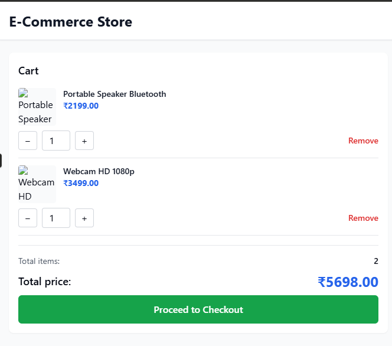

# 🛒 Mini E-Commerce React App

A fully functional **mini e-commerce web application** built with **React, TypeScript, Vite, and Tailwind CSS**.  
The project demonstrates product listing, filtering, cart management, and a complete checkout flow with mock data.

---

## 🚀 Live Demo

🎥 **Demo Video:**  
https://drive.google.com/file/d/1KjtusETH7pP2nGbK-un9mUFijk63ZF4R/view

---

## 📸 Screenshots

> 📌 Screenshots are stored in the `/screenshots` folder.

### Home / Product Listing
()

### Filters & Search


### Cart & Checkout


### Checkout Flow


---

## ✨ Features

- 🛍️ Product listing with categories
- 🔍 Search products by name
- 🗂️ Filter by category
- ↕️ Sort by price (Low → High, High → Low)
- 🛒 Add / remove items from cart
- 🔢 Quantity management with stock limits
- ⚠️ Low stock & out-of-stock indicators
- 💳 Multi-step checkout flow
- 📱 Fully responsive UI
- 🎨 Styled with Tailwind CSS

---

## 🧠 Tech Stack

- **Frontend:** React + TypeScript
- **Build Tool:** Vite
- **Styling:** Tailwind CSS
- **State Management:** React Hooks


# React + TypeScript + Vite

This template provides a minimal setup to get React working in Vite with HMR and some ESLint rules.

Currently, two official plugins are available:

- [@vitejs/plugin-react](https://github.com/vitejs/vite-plugin-react/blob/main/packages/plugin-react) uses [Babel](https://babeljs.io/) (or [oxc](https://oxc.rs) when used in [rolldown-vite](https://vite.dev/guide/rolldown)) for Fast Refresh
- [@vitejs/plugin-react-swc](https://github.com/vitejs/vite-plugin-react/blob/main/packages/plugin-react-swc) uses [SWC](https://swc.rs/) for Fast Refresh

## React Compiler

The React Compiler is not enabled on this template because of its impact on dev & build performances. To add it, see [this documentation](https://react.dev/learn/react-compiler/installation).

## Expanding the ESLint configuration

If you are developing a production application, we recommend updating the configuration to enable type-aware lint rules:

```js
export default defineConfig([
  globalIgnores(['dist']),
  {
    files: ['**/*.{ts,tsx}'],
    extends: [
      // Other configs...

      // Remove tseslint.configs.recommended and replace with this
      tseslint.configs.recommendedTypeChecked,
      // Alternatively, use this for stricter rules
      tseslint.configs.strictTypeChecked,
      // Optionally, add this for stylistic rules
      tseslint.configs.stylisticTypeChecked,

      // Other configs...
    ],
    languageOptions: {
      parserOptions: {
        project: ['./tsconfig.node.json', './tsconfig.app.json'],
        tsconfigRootDir: import.meta.dirname,
      },
      // other options...
    },
  },
])
```

You can also install [eslint-plugin-react-x](https://github.com/Rel1cx/eslint-react/tree/main/packages/plugins/eslint-plugin-react-x) and [eslint-plugin-react-dom](https://github.com/Rel1cx/eslint-react/tree/main/packages/plugins/eslint-plugin-react-dom) for React-specific lint rules:

```js
// eslint.config.js
import reactX from 'eslint-plugin-react-x'
import reactDom from 'eslint-plugin-react-dom'

export default defineConfig([
  globalIgnores(['dist']),
  {
    files: ['**/*.{ts,tsx}'],
    extends: [
      // Other configs...
      // Enable lint rules for React
      reactX.configs['recommended-typescript'],
      // Enable lint rules for React DOM
      reactDom.configs.recommended,
    ],
    languageOptions: {
      parserOptions: {
        project: ['./tsconfig.node.json', './tsconfig.app.json'],
        tsconfigRootDir: import.meta.dirname,
      },
      // other options...
    },
  },
])
```
